# LabSheet-01
แนะนำการใช้ ESP-IDF โปรแกรมไฟกระพริบวิบวับ

## ขั้นตอน
1. เปิดโปรแกรม Espressif IDE โดยการดับเบิ้ลคลิกที่ไอคอน โปรแกรมจะแสดง splash screen ดังภาพ

<p align="center">
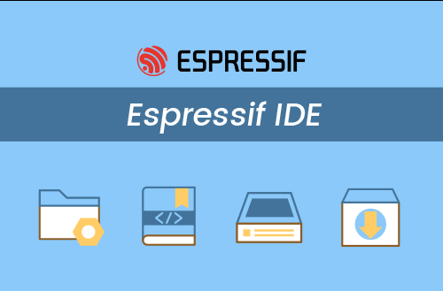
</p>


2. โปรแกรม Espressif IDE จะถามที่ตั้งของ Project (เรียกว่า Workspace) ให่ browse ไปยังที่จะสร้าง workspace อาจจะใช้ folder ที่มีอยู่แล้วหรือสร้างใหม่ก็ได้  __ซึ่งต้องไม่มี spacebar ในชื่อของ folder__ (ถ้ามี spacebar จะไม่สามารถสร้าง project ได้)

<p align="center">
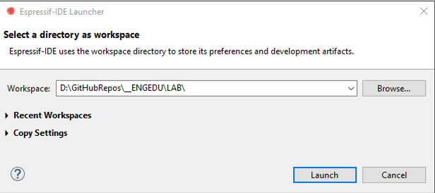
</p>

3. โปรแกรม Espressif IDE จะแสดงหน้าจอ Welcome

<p align="center">
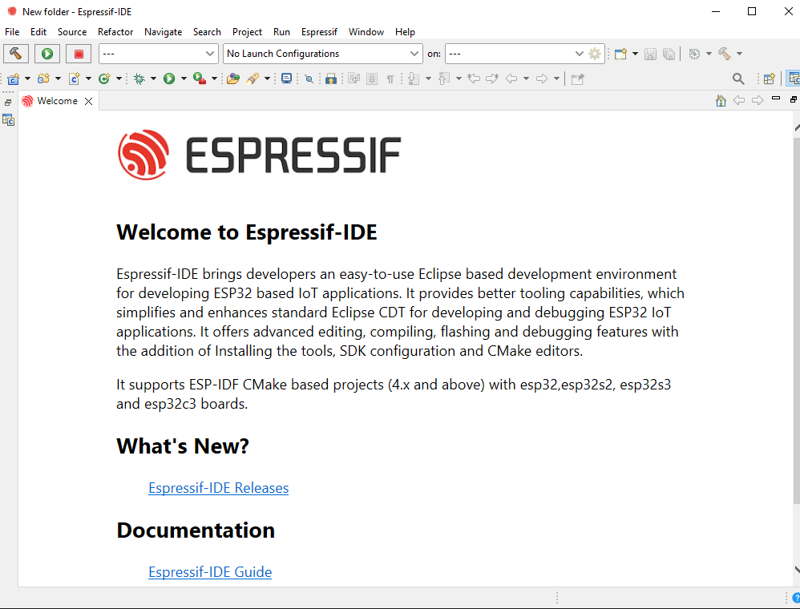
</p>


4. ให้ปิดหน้าต่าง Welcome แล้วโปรแกรม Espressif IDE จะแสดง Project Explorer ขึ้นมา

<p align="center">
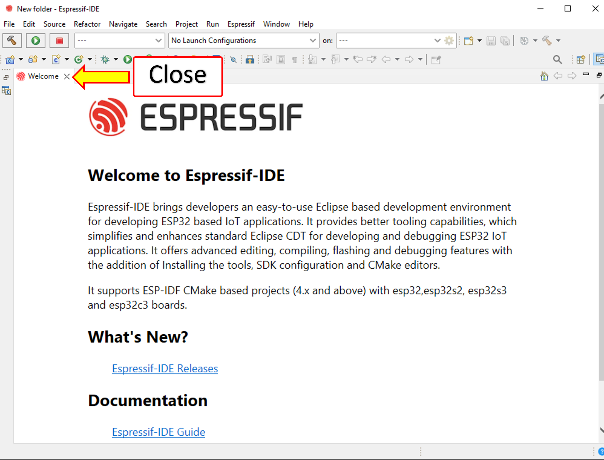
</p>

5. สร้างโปรเจคใหม่ โดยการคลิกที่ `Create a new EspressIF IDF project`


<p align="center">
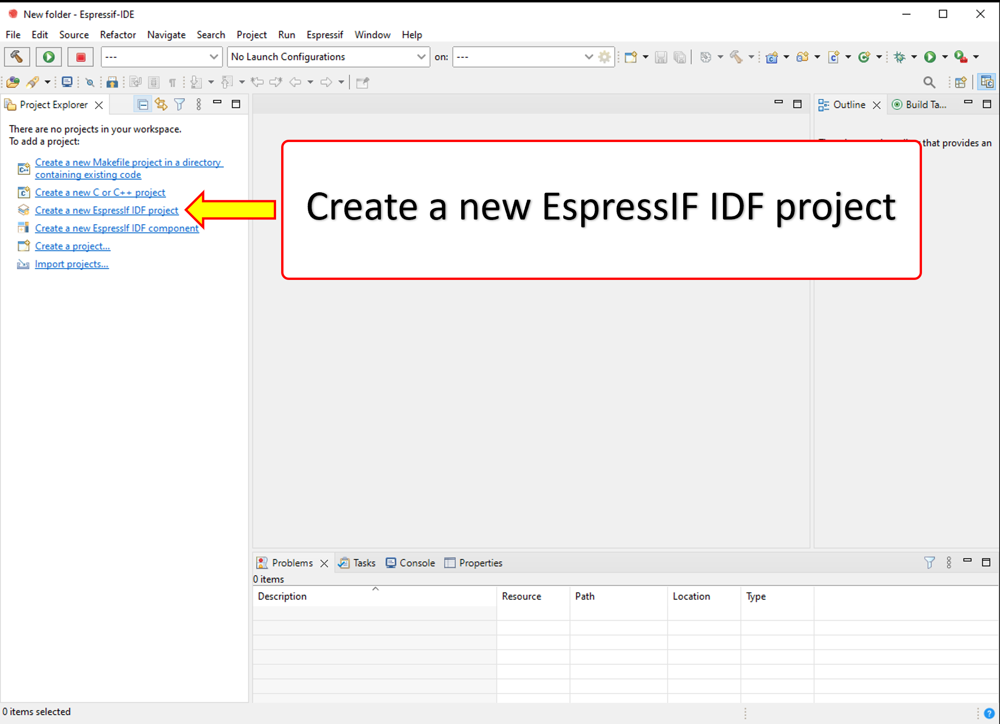
</p>

6. สร้างโปรเจค IDF โดยการกำหนด Project name ระวังอย่าให้ชื่อ project มี spacebar ถ้าต้องการแยกคำให้ใช้เครื่องหมายขีด (`-`) หรือ underscore (`_`)  เช่น `Lab-01-LED-Blinky`  หรือ `Lab-01-LED-Blinky` เสร็จแล้วกด `Finish` (ถ้ากดปุ่ม  `Next` จะสามารถเลือกโปรแกรมจากตัวอย่างได้)

<p align="center">
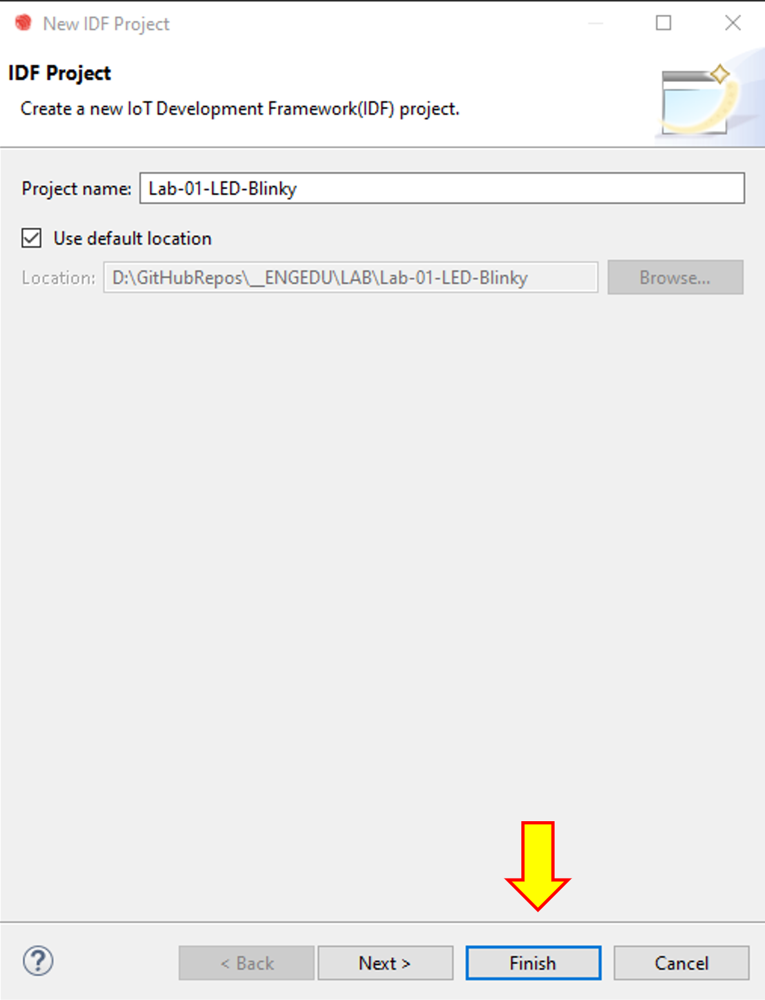
</p>


7. โปรแกรมพัฒนา (IDE) จะพามาที่หน้าโปรเจค ใน Project Explorer  ให้คลิกที่เครื่องหมาย `>` ที่หน้าชื่อโปรเจคและโฟลเดอร์ย่อยในนั้น จนกระทั่งเจอไฟล์ `main.c` ให้ดับเบิ้ลคลิกเพื่อเปิดไฟล์ `main.c` จะเห็นโปรแกรมเบื้องต้นที่ IDE สร้างให้มา  

<p align="center">
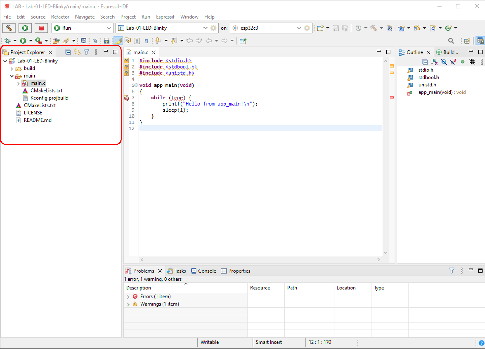
</p>


8. แก้ไขไฟล์ `main.c` ให่มีหน้าตาดังภาพด้านล่างนี้  

<p align="center">
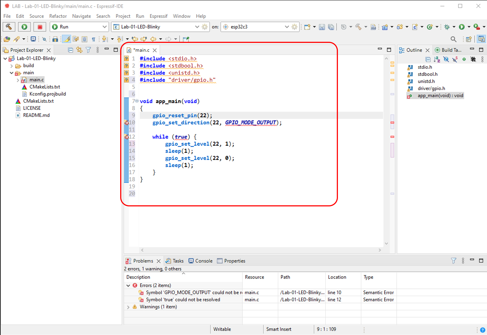
</p>

### Source code ของไฟล์ main.c ในตัวอย่างโปรแกรมไฟกระพริบ
``` C
#include <stdio.h>
#include <stdbool.h>
#include <unistd.h>
#include "driver/gpio.h"                        // เพื่อการใช้งาน digital output (GPIO)

void app_main(void)
{
    gpio_reset_pin(22);                         // รีเซ็ตสถานะของขาหมายเลข 22 
    gpio_set_direction(22, GPIO_MODE_OUTPUT);   // กำหนดให้ขาหมายเลข 22 เป็น digital output

    while (true)                                // while (true) = วนรอบไม่มีที่สิ้นสุด
    {
        gpio_set_level(22, 1);                  // สั่งให้ LED ติด
        sleep(1);                               // หน่วงเวลา 1 วินาที
        gpio_set_level(22, 0);                  // สั่งให้ LED ดับ
        sleep(1);                               // หน่วงเวลา 1 วินาที
    }
}
```

9. กำหนดบอร์ดพัฒนาที่ใช้ (ขั้นตอนนี้้จะทำเพียงครั้งแรก ที่เริ่ม workspace ใหม่หรือเปลี่ยนบอร์ดที่ใช้ในการทดลอง)
    
(1) คลิกที่ dropdown ของ  combobox `on:` 

(2) เลือกบอร์ดเป้าหมาย (ในชุดทดลองนี้เป็น esp32)

<p align="center">
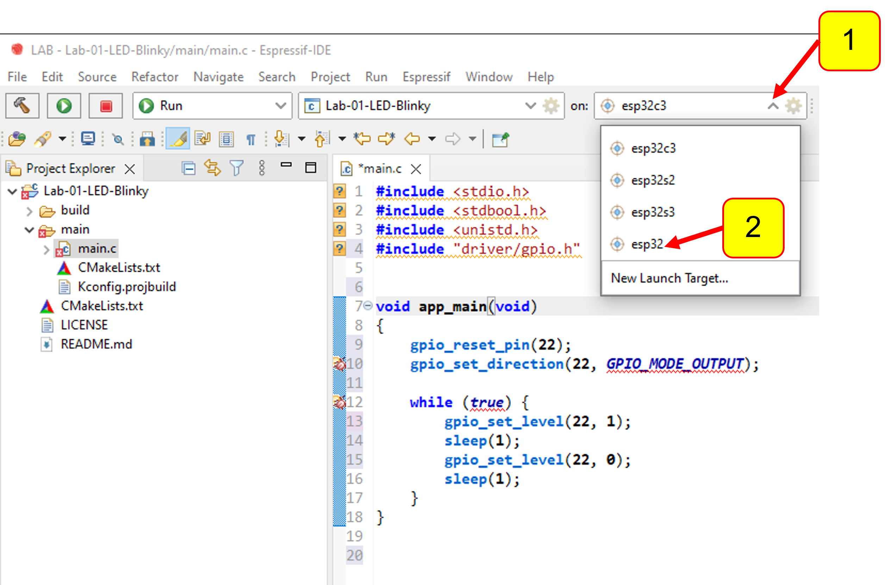
</p>


10.   Build โปรเจค ถ้ามีข้อผิดพลาดให้แก้ไขให้เรียบร้อย

(1) คลิกที่ปุ่ม  `Build` (ดังตำแหน่งในรูปด้านล่าง) 

(2) สังเกตุรายงานจาก IDE 
   
<p align="center">
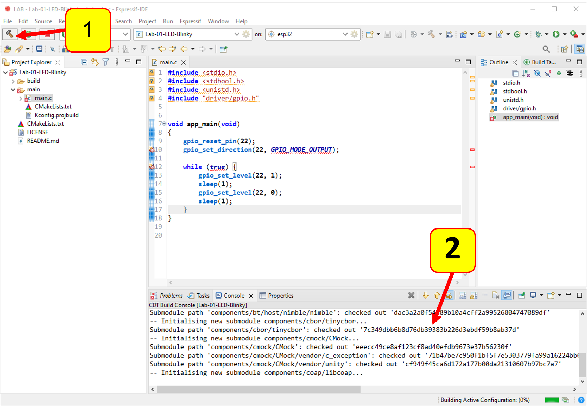
</p>


11. หากไม่มีสิ่งใดผิดพลาด (ทั้งการติดตั้งและ source code) โปรแกรม IDE จะสร้างโปรเจกต์จนเสร็จเรียบร้อยและรายงานขนาดสุดท้ายของ binary ที่จะเขียนลงใน microcontroller 

<p align="center">
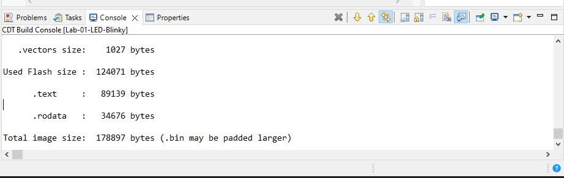
</p>

__ตัวอย่างรายงาน__

*รายละเอียดจะอธิบายเพิ่มเติมในโอกาสถัดไป*  

```
Used static DRAM:   11352 bytes ( 169384 remain, 6.3% used)
      .data size:    9064 bytes
      .bss  size:    2288 bytes
Used static IRAM:   45762 bytes (  85310 remain, 34.9% used)
      .text size:   44735 bytes
      .vectors size:    1027 bytes
Used Flash size :  124071 bytes
      .text     :   89139 bytes
      .rodata   :   34676 bytes
Total image size:  178897 bytes (.bin may be padded larger)

C:\Espressif\python_env\idf4.4_py3.8_env\Scripts\python.exe C:/Espressif/frameworks/esp-idf-v4.4.2/\components\partition_table\gen_esp32part.py D:\GitHubRepos\__ENGEDU\LAB\Lab-01-LED-Blinky\build\partition_table\partition-table.bin
Total time taken to build the project: 163,765 ms
```


## การ Upload Firmware  สู่บอร์ดทดลอง
คลิกที่นี่  [การ upload Firmware สู่บอร์ดทดลอง](UploadFirmware.md)

## ผลการทำงาน
คลิกที่นี่  [ผลการทำงาน](Result.md)
