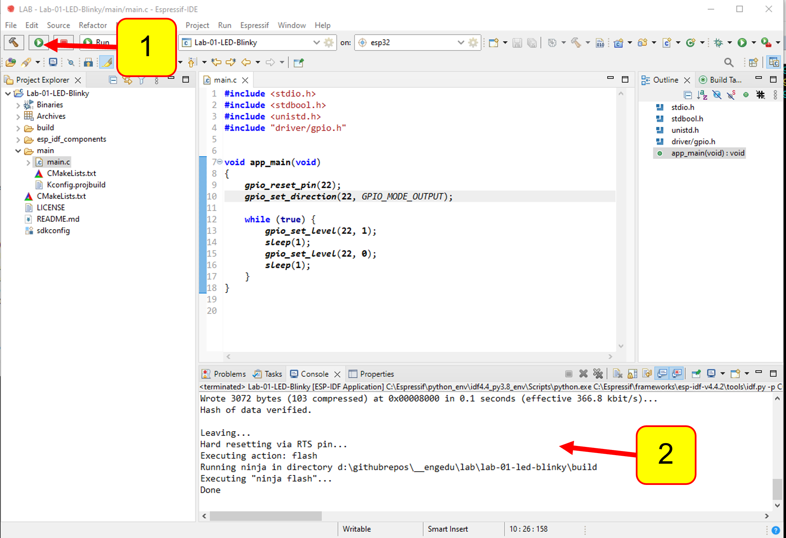

Repo:https://github.com/CHAIYAPRUK/LabSheet-01

# LabSheet-01 (การ upload firmware)

1. จากตัวอย่างโปรแกรม จะเห็นว่าเราใช้ GPIO หมายเลข 22  ดังนั้น ที่บนบอร์ด ให้ต่อสาย  jump จากขาที่เขียน GPIO22 ไปยัง LED ดวงหนึ่งที่อยู่บนบอร์ด (สมมติเป็น LED หมายเลข 8)


 <p align="center">

</p>


2. ให้ต่อบอร์ดทดลองเข้ากับ USB ของคอมพิวเตอร์


3. ให้เข้าไปที่ device manager เพื่อดูว่าหมายเลขของ communication port ที่คอมพิวเตอร์จัดให้บอร์ดทดลองของเราเป็นเลขอะไร ซึ่งบอร์ด ESP32 ที่ใช้ในการทดลองนี้ใช้ชิป USB to Serial รุ่น `Silicon Labs CP210x USB to UART Bridge` ให้จำชื่อ Communication port ไว้ ซึ่งในตัวอย่างนี้คือ __COM5__  
 

 <p align="center">

</p>

4. กลับมาที่โปรแกรม ESP32 IDE  ให้เลือก Comm port โดยคลิกที่รูปเฟืองใน combobox `on:` 

(1) คลิกที่รูปเฟืองใน combobox `on:`

(2) เลือก Communication port ที่ต่อกับบอร์ดทดลอง แล้วกด `Finish`

 <p align="center">

</p>

5. Upload firmware เข้าสู่บอร์ดทดลอง 

(1) คลิกปุ่ม `Launch in 'RUN' mode`

(2) สังเกตุการรายงานผลจาก IDE


 <p align="center">

</p>

ถ้าโปรแกรมได้สำเร็จ จะมีข้อความดังตัวอย่างต่อไปนี้

``` 
Connecting.....
Chip is ESP32-D0WD-V3 (revision 3)
Features: WiFi, BT, Dual Core, 240MHz, VRef calibration in efuse, Coding Scheme None
Crystal is 40MHz
MAC: 94:b5:55:f3:98:00
Uploading stub...
Running stub...
Stub running...
Changing baud rate to 460800
Changed.
Configuring flash size...
Flash will be erased from 0x00001000 to 0x00007fff...
Flash will be erased from 0x00010000 to 0x0003bfff...
Flash will be erased from 0x00008000 to 0x00008fff...
Compressed 25392 bytes to 15888...
Writing at 0x00001000... (100 %)
Wrote 25392 bytes (15888 compressed) at 0x00001000 in 0.8 seconds (effective 264.9 kbit/s)...
Hash of data verified.
Compressed 179024 bytes to 93086...
Writing at 0x00010000... (16 %)
Writing at 0x0001bc95... (33 %)
Writing at 0x000214bd... (50 %)
Writing at 0x0002717c... (66 %)
Writing at 0x0002f7b2... (83 %)
Writing at 0x0003794b... (100 %)
Wrote 179024 bytes (93086 compressed) at 0x00010000 in 2.6 seconds (effective 558.1 kbit/s)...
Hash of data verified.
Compressed 3072 bytes to 103...
Writing at 0x00008000... (100 %)
Wrote 3072 bytes (103 compressed) at 0x00008000 in 0.1 seconds (effective 366.8 kbit/s)...
Hash of data verified.

Leaving...
Hard resetting via RTS pin...
Executing action: flash
Running ninja in directory d:\githubrepos\__engedu\lab\lab-01-led-blinky\build
Executing "ninja flash"...
Done
```

6. สังเกตบนบอร์ด จะมีไฟกระพริบเป็นจังหวะติด-ดับสลับกันทุก 1 วินาที

- ถ้ามีสิ่งผิดปกติ เช่นไม่สามารถ  upload ได้ให้ตรวจสอบการเชื่อมต่อและหลายเลข Communication port ให้ถูกต้อง 
- ถ้ามีข้อความ Connecting............................. และรายงานว่าไม่สามารถเชื่อมต่อได้ ให้ทำการกดปุ่ม BOOT ที่บนบอร์ดไว้จนกว่าโปรแกรมได้  
- สามารถสังเกตว่าบอร์ดสามารถโปรแกรมได้ จากบรรทัดต่อไปนี้

```
Writing at 0x00010000... (16 %)
Writing at 0x0001bc95... (33 %)
Writing ...   
```
