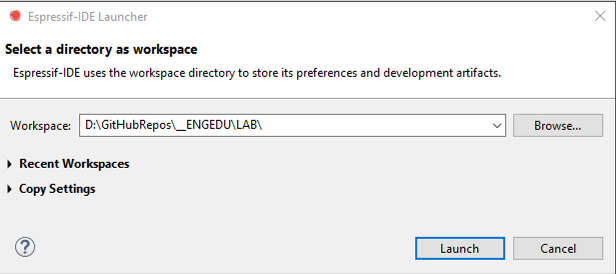
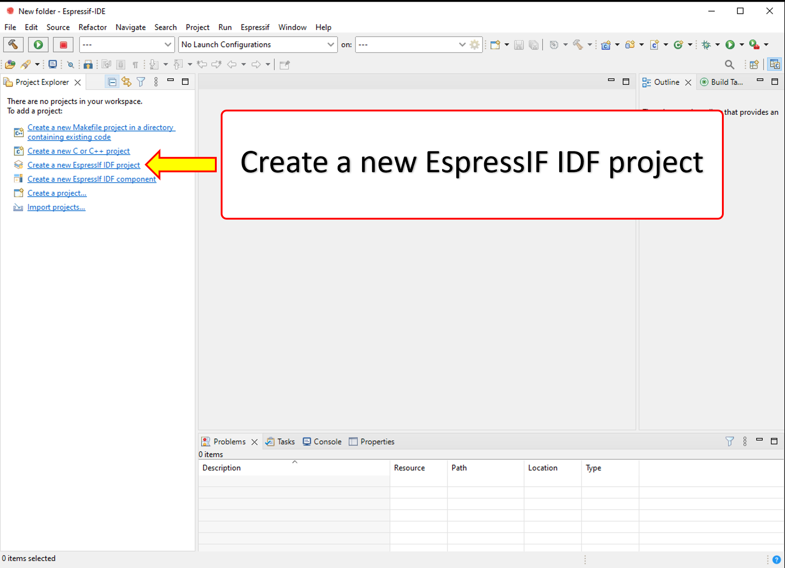
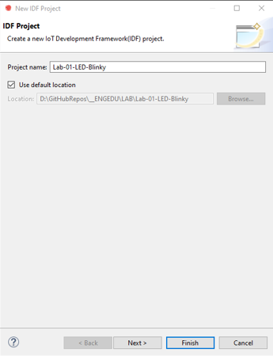
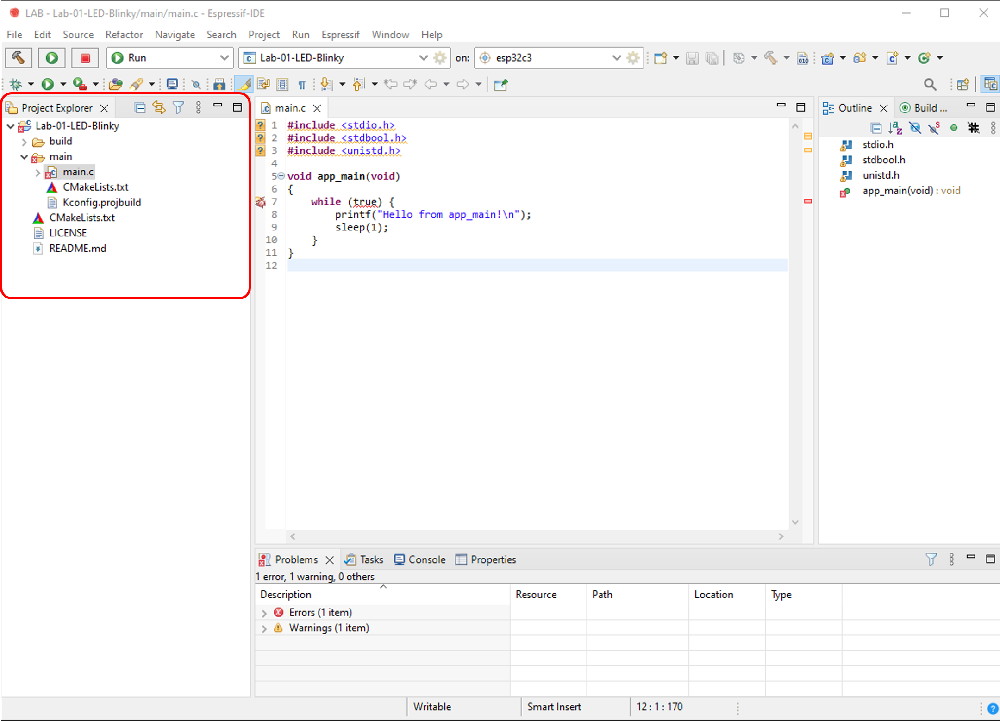
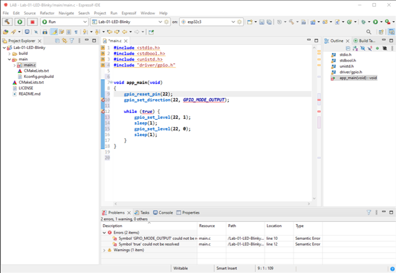
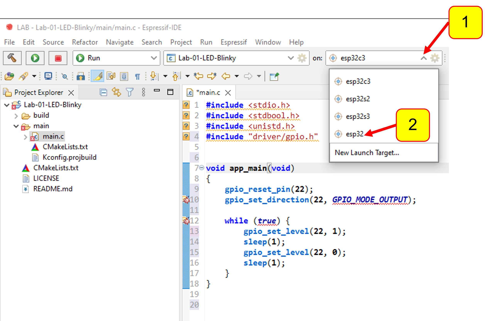
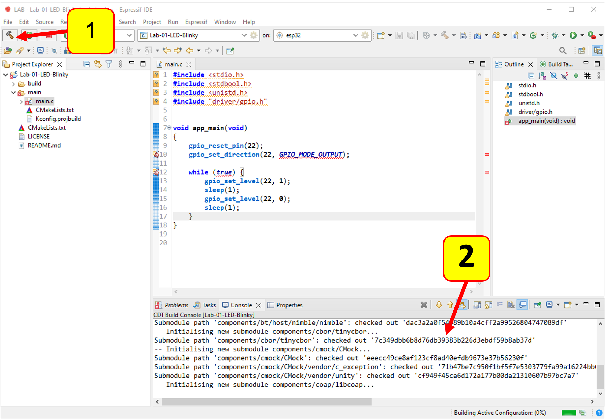

# LabSheet-01
แนะนำการใช้ ESP-IDF โปรแกรมไฟกระพริบวิบวับ

## ขั้นตอน
1. เปิดโปรแกรม Espressif IDE

<p align="center">

</p>


2. โปรแกรม Espressif IDE จะถามที่ตั้งของ Project (เรียกว่า Workspace) __ซึ่งต้องไม่มี spacebar ในชื่อของ folder__ (ถ้ามี spacebar จะไม่สามารถสร้าง project ได้) 

<p align="center">

</p>

3. โปรแกรม Espressif IDE จะแสดงหน้าจอ Welcome

<p align="center">

</p>


4. ให้ปิดหน้าต่าง Welcome แล้วโปรแกรม Espressif IDE จะแสดง Project Explorer ขึ้นมา

<p align="center">

</p>

5. สร้างโปรเจคใหม่ โดยการคลิกที่ `Create a new EspressIF IDF project`


<p align="center">

</p>

6. สร้างโปรเจค IDF โดยการกำหนด Project name ระวังอย่าให้ชื่อ project มี spacebar ถ้าต้องการแยกคำให้ใช้เครื่องหมายขีด (`-`) หรือ underscore (`_`)  เช่น `Lab-01-LED-Blinky`  หรือ `Lab-01-LED-Blinky`

<p align="center">

</p>


7. โปรแกรมพัฒนา (IDE) จะพามาที่หน้าโปรเจค ให้คลิกที่เครื่องหมาย `>` จนกระทั่งเจอไฟล์ `main.c` ให้ดับเบิ้ลคลิกเพื่อเปิดไฟล์ `main.c` จะเห็นโปรแกรมเบื้องต้นที่ IDE สร้างให้มา  

<p align="center">

</p>


8. แก้ไขไฟล์ `main.c` ให่มีหน้าตาดังภาพด้านล่างนี้  

<p align="center">

</p>

### Source code ของไฟล์ main.c ในตัวอย่างโปรแกรมไฟกระพริบ
``` C
#include <stdio.h>
#include <stdbool.h>
#include <unistd.h>
#include "driver/gpio.h"                        // เพื่อการใช้งาน digital output (GPIO)

void app_main(void)
{
    gpio_reset_pin(22);                         // รีเซ็ตสถานะของขาหมายเลข 22 
    gpio_set_direction(22, GPIO_MODE_OUTPUT);   // กำหนดให้ขาหมายเลข 22 เป็น digital output

    while (true)                                // while (true) = วนรอบไม่มีที่สิ้นสุด
    {
        gpio_set_level(22, 1);                  // สั่งให้ LED ติด
        sleep(1);                               // หน่วงเวลา 1 วินาที
        gpio_set_level(22, 0);                  // สั่งให้ LED ดับ
        sleep(1);                               // หน่วงเวลา 1 วินาที
    }
}
```

9. กำหนดบอร์ดพัฒนาที่ใช้ (ขั้นตอนนี้้จะทำเพียงครั้งแรก ที่เริ่ม workspace ใหม่หรือเปลี่ยนบอร์ดที่ใช้ในการทดลอง)
(1) คลิกที่ dropdown ของ  combobox `on:` 
(2) เลือกบอร์ดเป้าหมาย (ในชุดทดลองนี้เป็น esp32)

<p align="center">

</p>


10.  Build โปรเจค ถ้ามีข้อผิดพลาดให้แก้ไขให้เรียบร้อย
(1) คลิกที่ปุ่ม  `Build` (ดังตำแหน่งในรูปด้านล่าง) 
(2) สังเกตุรายงานจาก IDE 
   
<p align="center">

</p>


## การดาวน์โหลด Firmware ลงสู่บอร์ดทดลอง
คลิกที่นี่ 
